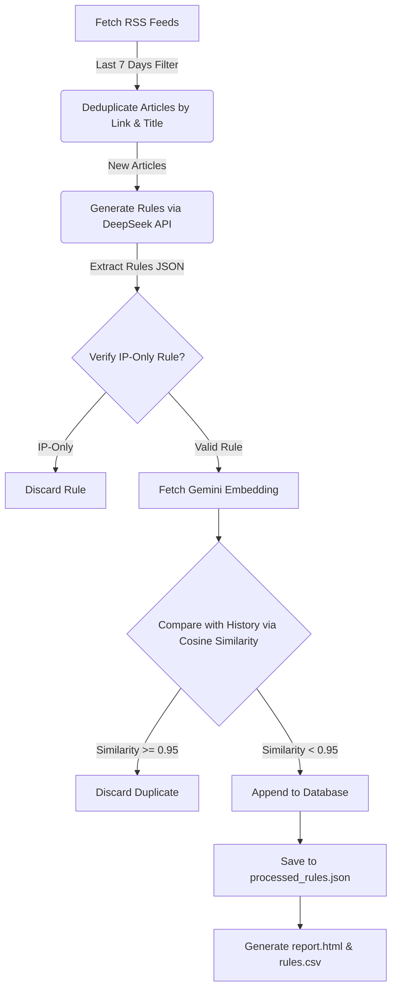

# Automated SIEM Detection Engineering Platform

An end-to-end automated platform that monitors threat intelligence RSS feeds, extracts detection rules using DeepSeek V3/V4, performs semantic deduplication using Google's Gemini embeddings, and renders a fully interactive HTML5 dashboard along with a CSV report.

---

## 🚀 Key Features

* **Real-time Threat Intel Monitoring**: Periodically scans RSS feeds from leading sources (Unit 42, Red Canary, Mandiant, CISA, DFIR Radar, and The DFIR Report) looking for articles published in the last 7 days.
* **Standardized Elastic ECS Rule Generation**: Automatically generates Kibana Query Language (KQL) detection rules mapping to standard Elastic Common Schema (ECS) fields.
* **Semantic Deduplication**: Uses Google's free Gemini Embedding API (`models/gemini-embedding-2`) to compute 3072-dimensional semantic vectors. Uses pure-Python cosine similarity checks at a `0.95` threshold to discard rules with similar detection ideas, preventing rule fatigue.
* **Strict Detection Exclusions**:
  * **No UEBA**: Excludes anomaly detection/User Behavior Analytics.
  * **No Native Cloud**: Excludes AWS CloudTrail, Azure Activity, Google Workspace, SharePoint/Exchange, iManage, CyberArk, etc.
  * **Windows & Linux Focus**: Focuses solely on endpoint-centric log sources (processes, commands, file events, registry, local network). Excludes macOS, iOS, and Android.
  * **No Static IP-only Rules**: Programmatically and prompt-level enforces that any rules referencing IP addresses must be combined with another parameter (ports, process name, event code, etc.). Static IP-only rules are automatically skipped.
* **Dynamic Interactive Dashboard**: Includes a beautifully styled dark-mode report with color-coded severity badges, status checklist tracking (To Do, In Progress, Done, N/A) backed by local storage, search functionality, and real-time statistics counters.
* **Dual-Format CSV Export**:
  * Automatically outputs all rules to a consolidated `rules.csv` file on run.
  * Provides an **Export Filtered to CSV** button on the HTML dashboard to download the exact filtered ruleset directly in the browser.

---

## ⚙️ How It Works (End-to-End Workflow)



1. **Feed Fetching**: The script pulls recent articles (last 7 days) and compares their links and titles against historical logs in `processed_rules.json`.
2. **AI Rule Extraction**: New articles are sent to the DeepSeek API. The model evaluates the report IOCs/tactics and outputs structured JSON containing rule parameters (Rule Name, KQL Condition, Severity, MITRE ATT&CK Technique, Target Process, and Description).
3. **Programmatic Validation**: The script passes the KQL condition through `is_ip_only_rule()` to verify it doesn't target an IP address in isolation.
4. **Semantic Embedding Analysis**:
   * If a rule is valid, it retrieves a 3072-dimensional vector representation of the rule using the Gemini API.
   * It calculates the cosine similarity between the new vector and existing rules in the database. If it exceeds `0.95`, the rule is discarded.
5. **Report Compilation**: The script compiles the final dashboard (`report.html`) using Jinja2 and writes the CSV database (`rules.csv`).

---

## 📋 Requirements

* **Python**: Version `3.10` or higher.
* **Dependencies**: Listed in `requirements.txt`:
  * `feedparser==6.0.11` (RSS parsing)
  * `openai>=1.0.0` (DeepSeek interaction)
  * `jinja2==3.1.4` (HTML template rendering)
  * `google-generativeai>=0.8.0` (Gemini embeddings)
* **API Keys**:
  * **DeepSeek API Key**: A valid key to call the DeepSeek V3/V4 chat completions endpoints.
  * **Gemini API Key**: A valid key to generate embeddings (runs on Google AI Studio's free tier).

---

## 🛠️ Installation & Setup

### 1. Clone the Workspace
Make sure your terminal is inside the project directory:
```powershell
cd c:\Users\dfir\Desktop\Ai_Projects\Detection_Engg
```

### 2. Create and Activate Virtual Environment
```powershell
# Create venv
python -m venv .venv

# Activate venv
.venv\Scripts\Activate.ps1
```

### 3. Install Dependencies
```powershell
pip install -r requirements.txt
```

### 4. Configure API Keys
The script loads the Gemini API key from the environment variable `GEMINI_API_KEY` (with a hardcoded fallback inside the script config block) and the DeepSeek API key from `DEEPSEEK_API_KEY` inside `generate_rules.py`:
```python
# --- Configuration ---
DEEPSEEK_API_KEY = "sk-...." # Replace with your DeepSeek Key
GEMINI_API_KEY = "AIQ..."      # Replace with your Gemini Key
```

---

## 💻 Usage

Run the script using the virtual environment Python interpreter:
```powershell
.venv\Scripts\python.exe generate_rules.py
```

### Script Outputs
* **`report.html`**: The interactive dark-mode HTML dashboard.
* **`rules.csv`**: A CSV database containing four key columns:
  1. `Source`
  2. `Rule Name`
  3. `Description`
  4. `Logic` (KQL query)
* **`processed_rules.json`**: The persistent local state store database keeping track of processed articles and generated rule embeddings.

---

## 📊 Dashboard Controls & Customization

Open `report.html` in any web browser to view the dynamic dashboard:
1. **Interactive Filters**:
   * **Source Filter**: View rules originating from a specific vendor.
   * **Status Filter**: Track your deployment status (To Do, In Progress, Done, N/A). Statuses are persistently stored in your browser's LocalStorage.
   * **Severity Filter**: View rules based on risk levels (Critical, High, Medium, Low).
   * **Search Box**: Perform case-insensitive full-text keyword searches across names, descriptions, and KQL code.
2. **Dynamic Counter Updates**: The stats cards at the top (**Rules by Source** and **Rules by Severity**) recalculate in real-time to match the visible rules matching your filters.
3. **Export Filtered to CSV**: Click the **Export Filtered to CSV** button to download a spreadsheet containing only the rules currently matching your active filter criteria.
